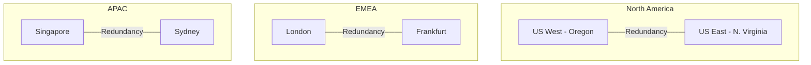

# Platform Architecture Overview

> **Last Updated:** 2026-01-19  
> **Status:** ✅ Complete

## Introduction

Natterbox is a cloud-based enterprise telephony platform that integrates voice communications with Salesforce CRM. The platform provides:

- **Voice Services** - Inbound/outbound calling, IVR, call routing
- **Omnichannel** - SMS, chat, email alongside voice
- **CRM Integration** - Deep Salesforce integration via AVS package
- **AI/CAI** - Conversational AI capabilities
- **Analytics** - Call analytics, reporting, observability (Lumina)

## Documentation Index

### Global Architecture
- **[Global Platform Architecture](./global-architecture.md)** - Complete platform overview including environment types (RT, SDC, GDC, Hybrid), technology stack, and AWS infrastructure layout

### Subsystem Documentation

| Subsystem | Status | Documentation |
|-----------|--------|---------------|
| Voice Routing | ✅ Complete | [Overview](./voice-routing/overview.md), [fsxinetd](./voice-routing/fsxinetd.md) |
| Omnichannel | 🔲 Planned | [Folder](./omnichannel/) |
| Salesforce Integration | 🔲 Planned | [Folder](./salesforce-integration/) |
| AI/CAI | 🔲 Planned | [Folder](./ai-cai/) |
| Infrastructure | 🔲 Planned | [Folder](./infrastructure/) |

## Global Infrastructure

Each region operates with:
- 3 Availability Zones
- 99.99% uptime target
- ISO 27001 and GDPR compliance

## Technology Stack Summary

### Backend
- **PHP** - Legacy platform services (Kohana framework)
- **TypeScript/Node.js** - Modern services
- **Go** - High-performance components
- **C/C++** - FreeSWITCH, low-level components

### Infrastructure
- **AWS** - Primary cloud provider (6 regions)
- **Terraform** - Infrastructure as code (~120 modules)
- **Salt Stack** - Configuration management

### Databases
- **MariaDB/MySQL** - Primary relational data
- **DynamoDB** - NoSQL, global tables
- **Redis** - Caching
- **Elasticsearch** - Search and analytics

### Frontend
- **React** - Modern web applications
- **Svelte** - Some newer applications
- **Swift/Kotlin** - Native mobile apps

## Diagram Sources

Original diagrams are maintained in Google Drive (draw.io):

| Diagram | Link |
|---------|------|
| Technology Stack | [View](https://app.diagrams.net/#G1_IwiTdsl51VoPQpqlhzxkdZF7cGYcUeg) |
| Global Architecture | [View](https://app.diagrams.net/#G1DCanRWtvPIaOKtYly74I5piHdp_ylGbU) |
| Voice Subsystem | [View](https://app.diagrams.net/#G1RoRjZ47B-2tjcBAXY9K8AXY6zgyFmEz4) |

## Related Documentation

- [Service Inventory](../services/inventory.md)
- [Repository Inventory](../services/repository-inventory.md)
- [Terraform Module Catalog](../terraform-modules/catalog.md)

## Source

This documentation was migrated from and supplements the [Confluence Architecture Space](https://natterbox.atlassian.net/wiki/spaces/A).

---

*Last updated: 2026-01-19*
