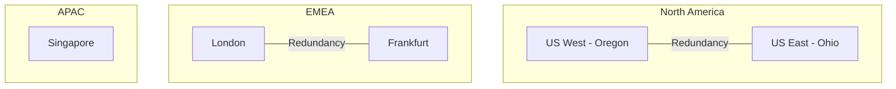

# Platform Architecture Overview

> ⚠️ **Status:** Draft - In Progress

## Introduction

Natterbox is a cloud-based enterprise telephony platform that integrates voice communications with Salesforce CRM. The platform provides:

- **Voice Services** - Inbound/outbound calling, IVR, call routing
- **Omnichannel** - SMS, chat, email alongside voice
- **CRM Integration** - Deep Salesforce integration via AVS package
- **AI/CAI** - Conversational AI capabilities
- **Analytics** - Call analytics, reporting, observability (Lumina)

## Global Infrastructure

Each region operates with:
- 3 Availability Zones
- 99.99% uptime target
- ISO 27001 and GDPR compliance

## High-Level Architecture

*TODO: Pull block diagrams from Confluence Architecture space*

## Core Subsystems

| Subsystem | Description | Key Components |
|-----------|-------------|----------------|
| [Voice Routing](voice-routing/) | Core telephony, call handling | FreeSWITCH, dialplan, fsxinetd |
| [Omnichannel](omnichannel/) | Multi-channel communication | Omniservice, chat widget |
| [Salesforce Integration](salesforce-integration/) | CRM integration | AVS, SCV connector |
| [Infrastructure](infrastructure/) | Cloud infrastructure | AWS, Terraform, Salt |
| [AI/CAI](ai-cai/) | Conversational AI | CAI service, Bedrock |

## Technology Stack

### Backend
- **PHP** - Legacy platform services (Kohana framework)
- **TypeScript/Node.js** - Modern services
- **Go** - High-performance components
- **C/C++** - FreeSWITCH, low-level components

### Infrastructure
- **AWS** - Primary cloud provider
- **Terraform** - Infrastructure as code
- **Salt Stack** - Configuration management

### Databases
- **MariaDB/MySQL** - Primary relational data
- **Redis** - Caching
- **Elasticsearch** - Search and analytics

### Frontend
- **React** - Modern web applications
- **Svelte** - Some newer applications

## Related Documentation

- [Service Inventory](../services/inventory.md)
- [Terraform Module Catalog](../terraform-modules/catalog.md)

---

*Last updated: 2026-01-19*
