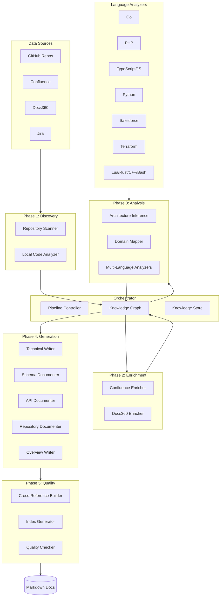

# Platform Documentation Agent

An AI-powered documentation generation system that creates comprehensive, layered documentation for the Natterbox platform by analyzing source code repositories, Confluence spaces, Jira projects, and Docs360 articles.

## Overview

The Documentation Agent uses a **multi-agent architecture** coordinated by an orchestrator to:

1. **Discover** services from GitHub repositories across multiple organizations
2. **Enrich** service information with documentation from Confluence and Docs360
3. **Analyze** code using multi-language AST parsers to extract models, endpoints, and side effects
4. **Generate** hierarchical markdown documentation with cross-references
5. **Validate** quality and ensure consistency across all generated documents

## Architecture



## Multi-Language Code Analysis

The agent includes a sophisticated code analysis system supporting **12 programming languages**:

| Language | Extracts | Framework Support |
|----------|----------|-------------------|
| **Go** | Structs, interfaces, HTTP routes, AWS SDK calls | Chi, Gorilla, Echo, Gin |
| **PHP** | Classes, controllers, services, REST endpoints | Kohana, Laravel |
| **TypeScript/JavaScript** | Interfaces, types, routes, React components | Express, NestJS, Next.js, Fastify |
| **Python** | Classes, dataclasses, routes, DB operations | Flask, FastAPI, Django, SQLAlchemy |
| **Salesforce** | Apex classes, triggers, SOQL, @AuraEnabled | Apex, LWC, Visualforce |
| **Terraform** | Resources, variables, outputs, modules | AWS, GCP, Azure providers |
| **Rust** | Structs, enums, traits, HTTP routes | Actix, Axum, Rocket |
| **Lua** | Functions, FreeSWITCH dialplans | FreeSWITCH |
| **Bash** | Functions, env vars, external commands | Shell scripts |
| **C/C++** | Structs, classes, enums | Standard C/C++ |
| **ActionScript** | Classes, MXML components | Flex |

### What Gets Extracted

- **Data Models**: Classes, structs, interfaces, types with fields and methods
- **API Endpoints**: HTTP routes, GraphQL resolvers, RPC methods
- **Side Effects**: Database queries, HTTP calls, file operations, cloud service calls
- **Configuration**: Environment variables, config files, constants
- **Dependencies**: Package dependencies with versions

## Pipeline Phases

### Phase 1: Discovery

Scans GitHub repositories across configured organizations to discover services:

- Clones repositories locally (avoids API rate limits)
- Detects primary programming languages
- Identifies service types (Lambda, ECS, API, library)
- Extracts README content and repository metadata

### Phase 2: Enrichment

Queries external documentation sources for each discovered service:

- **Confluence**: Searches for related documentation pages
- **Docs360**: Fetches support articles and guides
- Maps external docs to services using name matching and content analysis

### Phase 3: Analysis

Builds a comprehensive knowledge graph:

- Runs multi-language code analyzers
- Infers service architecture and dependencies
- Maps services to business domains
- Identifies integration points between services

### Phase 4: Generation

Generates layered markdown documentation:

```
docs/
├── index.md                    # Platform overview
├── architecture/
│   ├── overview.md            # High-level architecture
│   ├── data-flows.md          # Data flow diagrams
│   └── domains/               # Business domain docs
├── services/
│   └── {service-name}/
│       ├── README.md          # Service overview
│       ├── architecture.md    # Service architecture
│       ├── configuration.md   # Config reference
│       ├── operations.md      # Runbook/operations
│       └── data/
│           ├── models.md      # Data models
│           └── side-effects.md # External interactions
├── repositories/
│   └── repos/
│       └── {repo-name}/
│           ├── README.md      # Repository overview
│           └── structure.md   # Code structure
└── api/
    └── overview.md            # API documentation
```

### Phase 5: Quality

Validates and enhances generated documentation:

- Cross-references between documents
- Generates navigation indexes
- Validates internal links
- Checks for completeness

## Installation

```bash
# Clone the repository
git clone https://github.com/SemiConscious/platform-documents.git
cd platform-documents/doc-agent

# Install dependencies
pip install -e .

# Or with development dependencies
pip install -e ".[dev]"
```

### Optional: Tree-sitter for Enhanced Parsing

For AST-based code analysis (more accurate than regex):

```bash
pip install tree-sitter-language-pack>=0.4.0
```

## Configuration

Create a configuration file at `config/config.yaml`:

```yaml
# GitHub organizations to scan
github:
  organizations:
    - redmatter
    - natterbox
    - SemiConscious

# MCP server for Natterbox data sources
mcp:
  url: "https://avatar.natterbox-dev03.net/mcp/sse"
  oauth:
    authorization_url: "https://avatar.natterbox-dev03.net/mcp/authorize"
    token_url: "https://avatar.natterbox-dev03.net/mcp/token"
    client_id: "doc-agent"

# AWS authentication (for Bedrock LLM)
auth:
  aws:
    profile: "ssh-dev03-admin"
    region: "us-east-1"

# Logging
logging:
  level: INFO
  file: "logs/doc-agent.log"
```

## Usage

### Full Documentation Generation

```bash
# Generate all documentation
doc-agent generate --output ./docs --store ./store

# Full regeneration (ignore cached state)
doc-agent generate --full

# Verbose output
doc-agent generate -v
```

### Selective Generation

```bash
# Generate docs for specific service(s)
doc-agent generate --service archiving-purge --service platform-api

# Skip specific phases
doc-agent generate --skip-enrichment --skip-quality

# Dry run (no files written)
doc-agent generate --dry-run
```

### Repository Management

```bash
# Clone all repositories locally
doc-agent clone-repos --output ./repos

# Update existing clones
doc-agent clone-repos --update
```

### Other Commands

```bash
# List discovered services
doc-agent list-services

# Show knowledge graph statistics
doc-agent stats

# Export knowledge graph
doc-agent export-graph --format json --output graph.json
```

## Project Structure

```
doc-agent/
├── src/
│   ├── agents/                 # Agent implementations
│   │   ├── discovery/          # Service discovery agents
│   │   ├── enrichment/         # Documentation enrichment
│   │   ├── analysis/           # Architecture analysis
│   │   ├── generation/         # Documentation generation
│   │   └── quality/            # Quality assurance
│   ├── analyzers/              # Multi-language code analyzers
│   │   ├── base.py             # Base analyzer class
│   │   ├── factory.py          # Analyzer factory
│   │   ├── models.py           # Data models
│   │   └── languages/          # Language-specific analyzers
│   ├── knowledge/              # Knowledge graph
│   │   ├── graph.py            # NetworkX-based graph
│   │   ├── models.py           # Entity models
│   │   └── store.py            # Persistent storage
│   ├── mcp/                    # MCP client for data sources
│   ├── auth/                   # Authentication (AWS SSO, OAuth)
│   ├── parsers/                # API schema parsers
│   ├── templates/              # Jinja2 template renderer
│   ├── orchestrator.py         # Pipeline orchestrator
│   └── main.py                 # CLI entry point
├── config/                     # Configuration files
├── templates/                  # Jinja2 document templates
└── repos/                      # Cloned repositories (gitignored)
```

## Knowledge Graph

The system maintains a knowledge graph with the following entity types:

- **Service**: Platform services (Lambda, ECS, API)
- **Repository**: GitHub repositories
- **Schema**: Data schemas (GraphQL, OpenAPI, Database)
- **Document**: External documentation (Confluence, Docs360)
- **Team**: Owning teams
- **Domain**: Business domains

Relationships tracked:
- `service → owns → repository`
- `service → depends_on → service`
- `service → has_schema → schema`
- `service → documented_in → document`
- `service → belongs_to → domain`

## LLM Integration

The agent uses Claude (via AWS Bedrock) for:

- Architecture inference from code patterns
- Documentation summarization
- Generating Mermaid diagrams
- Natural language descriptions

Configure your AWS profile with Bedrock access:

```bash
aws-vault exec ssh-dev03-admin -- doc-agent generate
```

## Development

```bash
# Run tests
pytest

# Run with coverage
pytest --cov=src

# Lint
ruff check src/

# Format
ruff format src/
```

## License

Proprietary - Natterbox Ltd.
