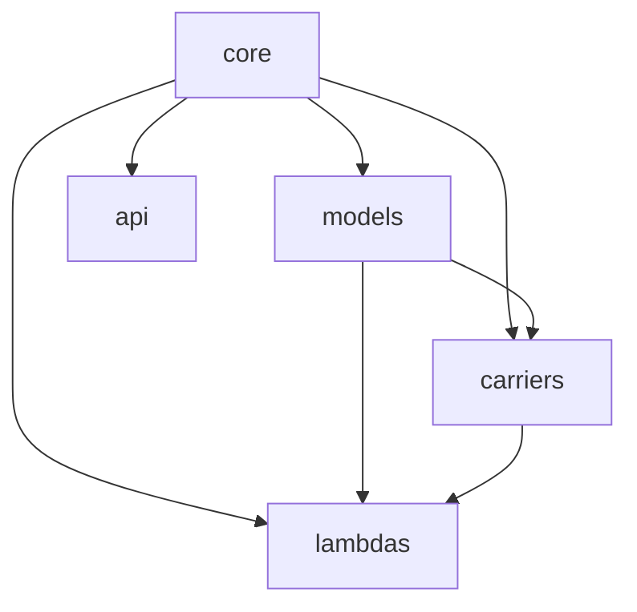

# Omni Channel Service Overview

[](https://www.typescriptlang.org/)
[](https://nodejs.org/)
[](https://aws.amazon.com/lambda/)
[](https://www.docker.com/)
[]()

> A TypeScript NodeJS monorepo implementing an omnichannel messaging pipeline that handles inbound/outbound message routing across multiple carriers with AWS Lambda-based processing.

---

## 📋 Table of Contents

- [Introduction](#introduction)
- [Architecture Overview](#architecture-overview)
- [Monorepo Package Structure](#monorepo-package-structure)
- [Quick Start](#quick-start)
- [Documentation Index](#documentation-index)
- [Development Setup](#development-setup)
- [Deployment Overview](#deployment-overview)

---

## Introduction

The **omnichannel-omniservice** is a comprehensive messaging infrastructure designed to unify communication across multiple carriers and channels. Built as a TypeScript monorepo, it provides a scalable, serverless architecture for handling millions of messages through a consistent pipeline.

### Key Capabilities

| Feature | Description |
|---------|-------------|
| **Multi-Carrier Support** | Seamless integration with WhatsApp, Twilio, Bandwidth, LiveChat, Messagebird, and Inteliquent |
| **Bidirectional Routing** | Handle both inbound and outbound message flows through unified pipelines |
| **Webhook Receivers** | Dedicated webhook endpoints for each carrier integration |
| **Workflow Processing** | Configurable workflow-based message handling and routing logic |
| **Push Notifications** | Cross-platform push notification delivery system |
| **Media Conversion** | Automatic media format conversion and optimization |
| **Stream Processing** | Real-time DynamoDB stream processing for event-driven workflows |
| **Modular Architecture** | Clean separation of concerns through monorepo package structure |

### Supported Carriers

```
┌─────────────┬─────────────┬─────────────┐
│  WhatsApp   │   Twilio    │  Bandwidth  │
├─────────────┼─────────────┼─────────────┤
│  LiveChat   │ Messagebird │ Inteliquent │
└─────────────┴─────────────┴─────────────┘
```

---

## Architecture Overview

The omnichannel-omniservice follows an event-driven, serverless architecture leveraging AWS Lambda functions for scalable message processing.

```
                                    ┌─────────────────────────────────────────┐
                                    │           External Carriers              │
                                    │  (WhatsApp, Twilio, Bandwidth, etc.)     │
                                    └──────────────────┬──────────────────────┘
                                                       │
                                                       ▼
┌──────────────────────────────────────────────────────────────────────────────────┐
│                              INBOUND PIPELINE                                     │
│  ┌─────────────┐    ┌─────────────┐    ┌─────────────┐    ┌─────────────┐        │
│  │  Webhook    │───▶│  Validator  │───▶│  Normalizer │───▶│  Router     │        │
│  │  Receivers  │    │  Lambda     │    │  Lambda     │    │  Lambda     │        │
│  └─────────────┘    └─────────────┘    └─────────────┘    └─────────────┘        │
└──────────────────────────────────────────────────────────────────────────────────┘
                                                       │
                                                       ▼
┌──────────────────────────────────────────────────────────────────────────────────┐
│                              CORE SERVICES                                        │
│  ┌─────────────┐    ┌─────────────┐    ┌─────────────┐    ┌─────────────┐        │
│  │  DynamoDB   │    │  Workflow   │    │   Media     │    │   Push      │        │
│  │  Streams    │    │  Engine     │    │  Converter  │    │  Service    │        │
│  └─────────────┘    └─────────────┘    └─────────────┘    └─────────────┘        │
└──────────────────────────────────────────────────────────────────────────────────┘
                                                       │
                                                       ▼
┌──────────────────────────────────────────────────────────────────────────────────┐
│                             OUTBOUND PIPELINE                                     │
│  ┌─────────────┐    ┌─────────────┐    ┌─────────────┐    ┌─────────────┐        │
│  │  Queue      │───▶│  Carrier    │───▶│  Rate       │───▶│  Delivery   │        │
│  │  Manager    │    │  Selector   │    │  Limiter    │    │  Handler    │        │
│  └─────────────┘    └─────────────┘    └─────────────┘    └─────────────┘        │
└──────────────────────────────────────────────────────────────────────────────────┘
```

### Technology Stack

| Layer | Technology |
|-------|------------|
| **Runtime** | Node.js 18.x with TypeScript |
| **Compute** | AWS Lambda |
| **Database** | DynamoDB |
| **Queue** | AWS SQS |
| **Storage** | AWS S3 |
| **API Gateway** | AWS API Gateway |
| **Container** | Docker |
| **Package Management** | npm with Workspaces |

---

## Monorepo Package Structure

The service is organized as a monorepo with clearly defined package boundaries:

```
omnichannel-omniservice/
├── packages/
│   ├── core/                    # Shared utilities and types
│   │   ├── src/
│   │   │   ├── types/          # TypeScript interfaces and types
│   │   │   ├── utils/          # Common utility functions
│   │   │   └── constants/      # Shared constants
│   │   └── package.json
│   │
│   ├── carriers/               # Carrier-specific implementations
│   │   ├── whatsapp/
│   │   ├── twilio/
│   │   ├── bandwidth/
│   │   ├── livechat/
│   │   ├── messagebird/
│   │   └── inteliquent/
│   │
│   ├── lambdas/                # Lambda function handlers
│   │   ├── inbound-router/
│   │   ├── outbound-processor/
│   │   ├── webhook-receiver/
│   │   ├── media-converter/
│   │   ├── push-notifier/
│   │   └── stream-processor/
│   │
│   ├── models/                 # Data models and schemas (100 models)
│   │   ├── src/
│   │   │   ├── message/
│   │   │   ├── conversation/
│   │   │   ├── carrier/
│   │   │   └── workflow/
│   │   └── package.json
│   │
│   └── api/                    # API definitions (16 endpoints)
│       ├── src/
│       │   ├── routes/
│       │   ├── middleware/
│       │   └── handlers/
│       └── package.json
│
├── infrastructure/             # IaC and deployment configs
│   ├── terraform/
│   ├── cloudformation/
│   └── docker/
│
├── scripts/                    # Build and deployment scripts
├── package.json               # Root package.json
├── tsconfig.json              # TypeScript configuration
└── docker-compose.yml         # Local development setup
```

### Package Dependencies



---

## Quick Start

Get the omnichannel-omniservice running locally in under 5 minutes.

### Prerequisites

- **Node.js** 18.x or higher
- **npm** 9.x or higher
- **Docker** and Docker Compose
- **AWS CLI** configured with appropriate credentials
- **Git**

### Installation

```bash
# Clone the repository
git clone <repository-url>
cd omnichannel-omniservice

# Install dependencies across all packages
npm install

# Bootstrap the monorepo
npm run bootstrap

# Build all packages
npm run build
```

### Running Locally with Docker

```bash
# Start all services with Docker Compose
docker-compose up -d

# Verify services are running
docker-compose ps

# View logs
docker-compose logs -f
```

### Running Individual Packages

```bash
# Run a specific Lambda locally
npm run dev --workspace=packages/lambdas/inbound-router

# Run API service
npm run dev --workspace=packages/api

# Run tests for a specific package
npm test --workspace=packages/carriers/twilio
```

### Quick Verification

```bash
# Health check endpoint
curl http://localhost:3000/health

# Expected response:
# {"status": "healthy", "version": "1.0.0", "timestamp": "2024-01-15T10:30:00Z"}
```

---

## Documentation Index

Comprehensive documentation is available for all aspects of the service:

### Core Documentation

| Document | Description |
|----------|-------------|
| [System Architecture](docs/architecture.md) | Detailed system design, data flows, and architectural decisions |
| [API Documentation Index](docs/api/README.md) | Complete API reference for all 16 endpoints |
| [Data Models Overview](docs/models/README.md) | Documentation for all 100 data models and schemas |
| [Lambda Functions Overview](docs/lambdas/README.md) | Guide to all Lambda functions and their configurations |
| [Carrier Integrations Overview](docs/carriers/README.md) | Carrier-specific integration guides and configurations |

### Quick Links

- **Getting Started**: Begin with the [System Architecture](docs/architecture.md) for a high-level understanding
- **API Development**: Reference the [API Documentation Index](docs/api/README.md) for endpoint specifications
- **Data Structures**: Explore [Data Models Overview](docs/models/README.md) for schema definitions
- **Serverless Functions**: Check [Lambda Functions Overview](docs/lambdas/README.md) for function implementations
- **Carrier Setup**: Follow [Carrier Integrations Overview](docs/carriers/README.md) for carrier configurations

---

## Development Setup

### Environment Configuration

Create a `.env` file in the root directory:

```bash
# AWS Configuration
AWS_REGION=us-east-1
AWS_ACCESS_KEY_ID=your-access-key
AWS_SECRET_ACCESS_KEY=your-secret-key

# Database
DYNAMODB_ENDPOINT=http://localhost:8000
DYNAMODB_TABLE_PREFIX=omnichannel_

# Carrier Credentials
TWILIO_ACCOUNT_SID=your-twilio-sid
TWILIO_AUTH_TOKEN=your-twilio-token
WHATSAPP_API_KEY=your-whatsapp-key
BANDWIDTH_API_TOKEN=your-bandwidth-token
MESSAGEBIRD_ACCESS_KEY=your-messagebird-key

# Service Configuration
NODE_ENV=development
LOG_LEVEL=debug
API_PORT=3000
```

### Development Workflow

```bash
# Start development mode with hot-reload
npm run dev

# Run linting
npm run lint

# Run type checking
npm run type-check

# Run all tests
npm test

# Run tests with coverage
npm run test:coverage

# Format code
npm run format
```

### Docker Development Environment

```yaml
# docker-compose.yml provides:
services:
  - localstack      # AWS services emulation
  - dynamodb-local  # Local DynamoDB instance
  - api             # API service container
  - lambdas         # Lambda runtime emulator
```

```bash
# Build Docker images
docker-compose build

# Start with rebuild
docker-compose up --build

# Stop and clean up
docker-compose down -v
```

### Debugging

```bash
# Debug a specific Lambda
npm run debug --workspace=packages/lambdas/inbound-router

# Use VS Code debugger with launch.json configurations
# Attach to running Docker containers for debugging
```

---

## Deployment Overview

### Deployment Environments

| Environment | Description | Branch |
|-------------|-------------|--------|
| **Development** | Feature testing and integration | `develop` |
| **Staging** | Pre-production validation | `staging` |
| **Production** | Live environment | `main` |

### CI/CD Pipeline

```
┌─────────┐    ┌─────────┐    ┌─────────┐    ┌─────────┐    ┌─────────┐
│  Push   │───▶│  Build  │───▶│  Test   │───▶│ Deploy  │───▶│ Verify  │
│         │    │         │    │         │    │         │    │         │
└─────────┘    └─────────┘    └─────────┘    └─────────┘    └─────────┘
```

### Manual Deployment

```bash
# Build for production
npm run build:prod

# Deploy to staging
npm run deploy:staging

# Deploy to production
npm run deploy:prod

# Deploy specific package
npm run deploy --workspace=packages/lambdas/inbound-router -- --stage prod
```

### Infrastructure as Code

```bash
# Initialize Terraform
cd infrastructure/terraform
terraform init

# Plan changes
terraform plan -var-file=environments/prod.tfvars

# Apply changes
terraform apply -var-file=environments/prod.tfvars
```

### Monitoring and Observability

- **CloudWatch**: Lambda metrics and logs
- **X-Ray**: Distributed tracing
- **Alarms**: Automated alerting for critical metrics

---

## Contributing

1. Fork the repository
2. Create a feature branch (`git checkout -b feature/amazing-feature`)
3. Commit your changes (`git commit -m 'Add amazing feature'`)
4. Push to the branch (`git push origin feature/amazing-feature`)
5. Open a Pull Request

---

## Support

For questions or issues:
- Check the [documentation index](#documentation-index)
- Open an issue in the repository
- Contact the platform team

---

**omnichannel-omniservice** — Unifying communications across every channel. 🚀